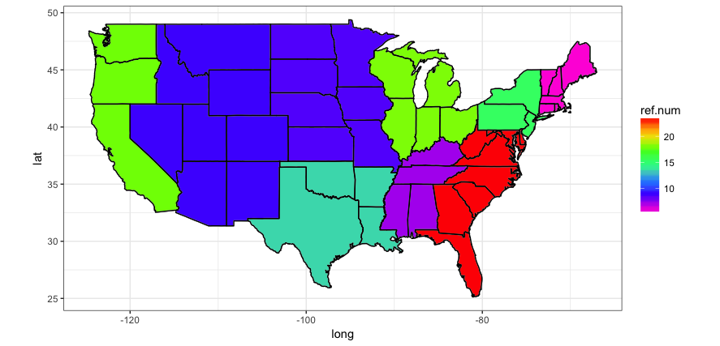

```{r setup, include=FALSE, warning=FALSE, message=FALSE}
knitr::opts_chunk$set(echo = TRUE)
require(maps)
require(tidyverse)
require(readxl)
require(plotly)
require(ggplot2)
require(reshape2)
require(dplyr)
require(ggmap)
require(mapdata)
```

```{r echo=FALSE, results='hide',message=FALSE}
############TYPE vs South/West Regions############
hc3_8 <- read_excel("./MyData/hc3.8.xlsx")
data1 = hc3_8
save( data1, file = "./MyData/data1.Rdata" )
data1

hc3_7 <- read_excel("./MyData/hc3.7.xlsx")
data2 = hc3_7
save(data2, file = "./MyData/data2.Rdata" )
data2

hc3_5 <- read_excel("./MyData/hc3.5.xlsx")
data3 = hc3_5
save(data3, file = "./MyData/data3.Rdata" )
data3

hc3_4 <- read_excel("./MyData/hc3.4.xlsx")
data4 = hc3_4
save(data4, file = "./MyData/data4.Rdata" )
data4

hc3_6 <- read_excel("./MyData/hc3.6.xlsx")
data5 = hc3_6
save(data5, file = "./MyData/data5.Rdata")
data5
```

```{r echo=FALSE, results='hide',message=FALSE, warning=FALSE}
####break the data into subsets####
fridgeSizeSW = data1[110:115 ,]
fridgeSizeNM = data2[107:112 ,]

fridgeTypeSW = data1[117:123 ,]
fridgeTypeNM = data2[114:120 ,]

incomeS = data3[107:112,]
incomeT = data3[114:120,]

membersS = data4[107:112,]
membersT = data4[114:120,]

climateS = data5[108:112,]
climateT =data5[115:120,]

```

```{r echo=FALSE, results='hide',message=FALSE, warning=FALSE}
####Init col names####
colnames(fridgeSizeSW) = c("Size", "Total","TotalSouth","South Atlantic","East South Central", "West South Central","Total West","Total Mountain", "Mountain North", "Mountain South", "Pacific")
colnames(fridgeSizeNM) = c("Size", "Total","Total Northeast","New England","Middle Atlantic", "Total Midwest","East North Central","West North Central")

colnames(fridgeTypeSW) = c("Type", "Total","TotalSouth","South Atlantic","East South Central", "West South Central","Total West","Total Mountain", "Mountain North", "Mountain South", "Pacific")
colnames(fridgeTypeNM) = c("Type", "Total","Total Northeast","New England","Middle Atlantic", "Total Midwest","East North Central","West North Central")

colnames(incomeS) = c("Size", "Total", "under_20", "20_40","40_60", "60_80", "80_100", "100_120","120_140", "over_140")
colnames(incomeT) = c("Type", "Total", "under_20", "20_40","40_60", "60_80", "80_100", "100_120","120_140", "over_140")

colnames(membersS) = c("Size", "Total", "OneMember", "TwoMembers", "ThreeMembers", "FourMembers", "FiveMoreMembers")
colnames(membersT) = c("Type", "Total", "OneMember", "TwoMembers", "ThreeMembers", "FourMembers", "FiveMoreMembers")

colnames(climateS) = c("Size", "Total", "Cold", "Mixed-humid", "Hot-dry", "Hot-humid", "Marine")
colnames(climateT) = c("Type", "Total", "Cold", "Mixed-humid", "Hot-dry", "Hot-humid", "Marine")

####Dropping total col####
fridgeSizeSW2 <- within(fridgeSizeSW, rm(Total))
fridgeSizeNM2 <- within(fridgeSizeNM, rm(Total))

fridgeTypeSW2 <- within(fridgeTypeSW, rm(Total))
fridgeTypeNM2 <- within(fridgeTypeNM, rm(Total))

incomeS2  <- within(incomeS, rm(Total))
incomeT2  <- within(incomeT, rm(Total))

membersS2  <- within(membersS, rm(Total))
membersT2  <- within(membersT, rm(Total))

climateS2  <- within(climateS, rm(Total))
climateT2  <- within(climateT, rm(Total))

####Coerce fridge size/type col to factors/categorical####
fridgeSizeSW2$Size <- as.factor(fridgeSizeSW2$Size)
fridgeSizeNM2$Size <- as.factor(fridgeSizeNM2$Size)

fridgeTypeSW2$Type <- as.factor(fridgeTypeSW2$Type)
fridgeTypeNM2$Type <- as.factor(fridgeTypeNM2$Type)

incomeS2$Size  <- as.factor(incomeS2$Size)
incomeT2$Type  <- as.factor(incomeT2$Type)

membersS2$Size  <- as.factor(membersS2$Size)
membersT2$Type  <- as.factor(membersT2$Type)

climateS2$Size  <- as.factor(climateS2$Size)
climateT2$Type  <- as.factor(climateT2$Type)

####Coerce rest of cols to continous/numeric####
fridgeSizeSW2[, 2:10] <- sapply(fridgeSizeSW2[, 2:10], as.numeric)
fridgeSizeNM2[, 2:7] <- sapply(fridgeSizeNM2[, 2:7], as.numeric)

fridgeTypeSW2[, 2:10] <- sapply(fridgeTypeSW2[, 2:10], as.numeric)
fridgeTypeNM2[, 2:7] <- sapply(fridgeTypeNM2[, 2:7], as.numeric)

incomeS2[, 2:9]  <- sapply(incomeS2[, 2:9], as.numeric)
incomeT2[, 2:9]  <- sapply(incomeT2[, 2:9], as.numeric)

membersS2[, 2:6]  <- sapply(membersS2[, 2:6], as.numeric)
membersT2[, 2:6]  <- sapply(membersT2[, 2:6], as.numeric)

climateS2[, 2:6] <- sapply(climateS2[, 2:6], as.numeric)
climateT2[, 2:6] <- sapply(climateT2[, 2:6], as.numeric)

####Rename cols####
colnames(fridgeSizeSW2) <- c("Size","Total South","South Atlantic","East South Central", "West South Central","Total West","Total Mountain", "Mountain North", "Mountain South", "Pacific")
colnames(fridgeSizeNM2) <- c("Size","Total Northeast","New England","Middle Atlantic", "Total Midwest","East North Central","West NorthC entral")

colnames(fridgeTypeSW2) <- c("Type","Total South","South Atlantic","East South Central", "West South Central","Total West","Total Mountain", "Mountain North", "Mountain South", "Pacific")
colnames(fridgeTypeNM2) <- c("Type","Total Northeast","New England","Middle Atlantic", "Total Midwest","East North Central","West North Central")

colnames(incomeS2)  <- c("Size", "Under 20,000", "20,000-40,000","40,000-60,000", "60,000-80,000", "80,000-100,000", "100,000-120,000","120,000-140,000", "Over 140,000")
colnames(incomeT2)  <- c("Type", "Under 20,000", "20,000-40,000","40,000-60,000", "60,000-80,000", "80,000-100,000", "100,000-120,000","120,000-140,000", "Over 140,000")

colnames(membersS2) = c("Size", "One Member", "Two Members", "Three Members", "Four Members", "Five or More Members")
colnames(membersT2) = c("Type", "One Member", "Two Members", "Three Members", "Four Members", "Five or More Members")

colnames(climateS2) = c("Size", "Cold", "Mixed-humid", "Hot-dry", "Hot-humid", "Marine")
colnames(climateT2) = c("Type", "Cold", "Mixed-humid", "Hot-dry", "Hot-humid", "Marine")

####Coerce into tibble --> easier to work with####
fridgeSizeSW3<- as_tibble(melt(fridgeSizeSW2, id = 1))
fridgeSizeNM3<- as_tibble(melt(fridgeSizeNM2, id = 1))

fridgeTypeSW3<- as_tibble(melt(fridgeTypeSW2, id = 1))
fridgeTypeNM3<- as_tibble(melt(fridgeTypeNM2, id = 1))

incomeS3  <- as_tibble(melt(incomeS2, id = 1))
incomeT3  <- as_tibble(melt(incomeT2, id = 1))

membersS3  <- as_tibble(melt(membersS2, id = 1))
membersT3  <- as_tibble(melt(membersT2, id = 1))

climateS3 <- as_tibble(melt(climateS2, id=1))
climateT3 <- as_tibble(melt(climateT2, id=1))

########Rename cols pt1 (xVar/var)###########
colnames(fridgeSizeSW3)[colnames(fridgeSizeSW3) == "variable"] <- "FridgeSize"
colnames(fridgeSizeNM3)[colnames(fridgeSizeNM3) == "variable"] <- "FridgeSize"

colnames(fridgeTypeSW3)[colnames(fridgeTypeSW3) == "variable"] <- "FridgeType"
colnames(fridgeTypeNM3)[colnames(fridgeTypeNM3) == "variable"] <- "FridgeType"

colnames(incomeS3)[colnames(incomeS3) == "variable"]   <- "Income"
colnames(incomeT3)[colnames(incomeT3) == "variable"]   <- "Income"

colnames(membersS3)[colnames(membersS3) == "variable"]   <- "Members"
colnames(membersT3)[colnames(membersT3) == "variable"]   <- "Members"

colnames(climateS3)[colnames(climateS3) == "variable"]   <- "Climate"
colnames(climateT3)[colnames(climateT3) == "variable"]   <- "Climate"


########rename cols pt2 (yVar/value)###########
colnames(fridgeSizeSW3)[colnames(fridgeSizeSW3) == "value"] <- "TotalFrequency"
colnames(fridgeSizeNM3)[colnames(fridgeSizeNM3) == "value"] <- "TotalFrequency"

colnames(fridgeTypeSW3)[colnames(fridgeTypeSW3) == "value"] <- "TotalFrequency"
colnames(fridgeTypeNM3)[colnames(fridgeTypeNM3) == "value"] <- "TotalFrequency"

colnames(incomeS3)[colnames(incomeS3) == "value"]   <- "TotalFrequency"
colnames(incomeT3)[colnames(incomeT3) == "value"]   <- "TotalFrequency"

colnames(membersS3)[colnames(membersS3) == "value"]   <- "TotalFrequency"
colnames(membersT3)[colnames(membersT3) == "value"]   <- "TotalFrequency"

colnames(climateS3)[colnames(climateS3) == "value"]   <- "TotalFrequency"
colnames(climateT3)[colnames(climateT3) == "value"]   <- "TotalFrequency"
##########################################################################################################################################################################################################################################################################################################################################

```

#Introduction: 
This report presents the analysis of the refrigerators characteristics data that was collected between Aug 2015 and April 2016 by the U.S. Energy Information Administration (eia). We will utilize a total of four data tables to explore the different trends between refrigerator types and refrigerator sizes across the different regions, South/West and North/Midwest, and across different income brackets and household sizes in the U.S. Based on that, we will discuss potential plans for effective marketing stratifies to increase the profit of refrigerators companies.



##Refrigerator Size vs Region

####Refrigerator Size vs South/West Region
The bar plot below visualizes a correlation between refrigerators size across different sub-regions in South/West. As supported by the mean and the stacked bar plot, in the Total South, Total West and all the sub-regions, medium sized refrigerators (17.6 to 22.5 cubic feet) are the most common followed by the large sized refrigerators (22.6 to 29.5 cubic feet). An outlier in this result is that 0.5 percent of the population in the Total South does not use a refrigerator. Another outlier is that only about half of the regions use a very large (more than 29.5 cubic feet) refrigerator.

```{r echo=FALSE, warning=FALSE, message=FALSE}
#PLOT 1 
fridgeSizeSW3 %>%
  group_by(Size) %>%
  summarise_all(funs(mean(., na.rm=TRUE)))

ggplot(fridgeSizeSW3, aes(x = FridgeSize, y = TotalFrequency)) + 
  geom_col(aes(fill = Size)) + coord_flip() +
  ggtitle("Fridge Size vs South/West Region") + labs(x="Fridge Size",y="Frequency") 
```

####Refrigerator Size vs North/Midwest Region
Similar to the results we found above, in the Total North, Total Midwest and all the sub-regions, medium sized refrigerators (17.6 to 22.5 cubic feet) again are the most common followed by the large sized refrigerators (22.6 to 29.5 cubic feet). However, unlike the South and West region above, there are no sub-regions here that use a half sized refrigerator or do not use a refrigerator at all.

```{r echo=FALSE, message=FALSE,warning=FALSE}
#PLOT 2
fridgeSizeNM3 %>%
  group_by(Size) %>%
  summarise_all(funs(mean(., na.rm=TRUE)))

ggplot(fridgeSizeNM3, aes(x = FridgeSize, y = TotalFrequency)) + 
  geom_col(aes(fill = Size)) + coord_flip() +
  ggtitle("Fridge Size vs North/Midwest Region") + labs(x="Fridge Size",y="Frequency") 
```

We can observe in the charts above that the sub-regions which contain the most refrigerators are the South Atlantic, Pacific, and the East North Central. In addition, there seems to be a relatively even split in each of those regions between medium and large sized appliances. Overall, however, the South contains the most refrigerators over the other regions by a very wide margin. There seems to be high demand in southern states for these appliances, especially closer to the coast. This large discrepancy may be due to population differences in the South versus the Midwest where cities are more densely populated in the former than the latter.

##Refrigerator Type vs Region

####Refrigerator Type vs South/West Region
Next we explore a possible coloration between the refrigerator types across sub-regions in South and West in the chart below. As seen in the faceted bar graph below, the most popular types of refrigerators in the South/West respectively are the two doors, top freezer and two doors, side to side. Concurring with the stacked bar graph that compares the sub-regions with fridge sizes, the sub-regions with the leading number of refrigerators are the South Atlantic, Pacific and West South Central. Again we note the outlier that 0.5 percent of the population in the Total South does not use a refrigerator.

```{r echo=FALSE, message=FALSE, warning=FALSE}
#PLOT 3
fridgeTypeSW3 %>%
  group_by(Type) %>%
  summarise_all(funs(mean(., na.rm=TRUE)))

ggplot(fridgeTypeSW3, aes(x = FridgeType, y = TotalFrequency)) +
   geom_bar(stat="identity") + facet_wrap(~ Type)  + coord_flip()  +
   ggtitle("Fridge Type vs South/West Region") + labs(x="Sub-Region",y="Frequency") 
```

####Refrigerator Type vs North/Midwest Region
Similarly, in North and Midwest sub-regions, the most popular types of refrigerators in the North/Midwest respectively are the two doors, top freezer and two doors, side to side. Concurring with the stacked bar graph that compared the sub-regions with fridge sizes, the sub-regions with the leading number of refrigerators are the East North Central and Middle Atlantic, respectively. Again, we note that zero percent of the population in the North/Midwest region uses compact fridge or does not use a fridge at all. 

```{r echo=FALSE, message=FALSE, warning=FALSE}
#PLOT 4
fridgeTypeNM3 %>%
  group_by(Type) %>%
  summarise_all(funs(mean(., na.rm=TRUE)))

ggplot(fridgeTypeNM3, aes(x = FridgeType, y = TotalFrequency)) +
   geom_bar(stat="identity") + facet_wrap(~ Type)  + coord_flip() +
   ggtitle("Fridge Type vs North/Midwest Region") + labs(x="Sub-Region",y="Frequency") 
```

We observe that across different regions, the medium sized refrigerator was the most popular followed closely by the large sized refrigerator. And the most popular types of refrigerators respectively are the two doors, top freezer and two doors, side to side. Additionally, overall very few sub-regions use a very large refrigerator. One main difference observed was the only in the South/West region where 0.4 and 0.5 percent of the population respectively use a half sized/compact fridge or do not use a refrigerator at all. In the North/Midwest regions, no one uses a half sized fridge, but everyone uses a fridge in general. Focusing only on the South/West region, we can see in the chart that two door refrigerators seem to be the most popular among consumers. Specifically, it appears the models with a top freezer are used the most while side by side doors are a close second. Production should focus on two door refrigerators with an option for separate climate control in each compartment of the appliance. 


####Income Levels and Household Members vs Refrigerator Size

```{r echo=FALSE, message=FALSE, warning=FALSE}
#PLOT5
# ggplot(incomeS3, aes(x = Income, y = TotalFrequency)) +
#   geom_point()  + facet_wrap(~ Size) + coord_flip() +
#   ggtitle("Fridge Size vs Income") + labs(x="Fridge Size",y="Frequency")

#OR PLOT 5 
# incomeS3 %>%
#   group_by(Size) %>%
#   summarise_all(funs(mean(., na.rm=TRUE)))

ggplot(incomeS3, aes(x = Income, y = TotalFrequency)) + 
  geom_col(aes(fill = Size), position="dodge") + coord_flip() +
  ggtitle("Fridge Size vs Income") + labs(x="Fridge Size",y="Frequency")
```

Concurring with the separate results we found above across the different regions, in every income bracket the most popular size of refrigerators is the medium (17.6 to 22.5 cubic feet) followed by the large sized refrigerators (22.6 to 29.5 cubic feet). It is important to note a couple of outliers in the data. First is that 0.4 percent of the population with a income of \$20,000 or less does not use a refrigerator. Second, 0.5 percent of the population with a income of \$20,000 or less uses a half sized or compact fridge, but only 0.2 percent of the population with an income between \$20,000 and \$40,000 uses a half sized fridge. 

We observe that lower income consumers prefer medium sized refrigerators almost twice as much as larger refrigerators. Despite a seemingly lower cost, smaller appliances do not seem to have sizable demand at any income level. As earnings increase consumers tend to favor larger refrigerators. This may relate to household size as higher income earners may have more members in their household, thus creating a need for larger appliances. We can also notice a slight surge of very large refrigerators among the wealthiest earners surveyed. Intuitively, it would make sense for larger households to need larger appliances to suit the needs of each member of the family; however, based on the second chart below, we can see that as family size increases, the market share for the largest appliance size decreases. Based on this data, one could assume owners of very large refrigerators own over-sized appliances for a specific reason, such as demand for a restaurant. Thus there may not be a market for extra-large refrigerators at increasingly higher income levels. 

```{r echo=FALSE, message=FALSE, warning=FALSE}
#PLOT 7 
# membersS3 %>%
#   group_by(Size) %>%
#   summarise_all(funs(mean(., na.rm=TRUE)))

ggplot(membersS3, aes(x = Size, y = TotalFrequency)) +
geom_col()  + facet_wrap(~ Members) + coord_flip() + geom_text(aes(label=TotalFrequency), vjust=1.5, hjust=-0.3) +
ggtitle("Fridge Size vs Household Members") + labs(x="Fridge Size",y="Frequency")
```

We notice that in smaller households (with one, two and three members) medium sized fridges are the most popular followed by large sized refrigerators. However, in larger households (four and five or more members), large sized refrigerators are the most popular followed very closely by medium sized refrigerators. These results make perfect sense since larger family household require a larger refrigerator. Two noteworthy results are that only in a one member household do 0.4 and 0.5 percent of the population respectively use half sized fridges or do not use a refrigerator at all. 


####Income Levels and Household Members vs Refrigerator Type

```{r echo=FALSE, message=FALSE, warning=FALSE}
#PLOT 6
# ggplot(incomeT3, aes(x = Income, y = TotalFrequency)) + 
#   geom_point()  + facet_wrap(~ Type) + coord_flip() +
#   ggtitle("Fridge Type vs Income") + labs(x="Fridge Type",y="Frequency")

#OR PLOT6
# incomeT3 %>%
#   group_by(Type) %>%
#   summarise_all(funs(mean(., na.rm=TRUE)))

ggplot(incomeT3, aes(x = Income, y = TotalFrequency)) + 
  geom_col(aes(fill = Type), position="dodge") + coord_flip() + 
  ggtitle("Fridge Type vs Income") + labs(x="Fridge Type",y="Frequency")
```

In the following income brackets, two doors, top freezer is the most popular type of fridge followed by the two doors, side to side: Under \$20,000, between \$20,000 and \$40,000, between \$40,000 and \$60,000, between \$60,000 and \$80,000. And inversely, in the following income brackets two doors, side to side is the most popular type of fridge followed by the two doors, top freezer: between \$80,000 and \$100,000, between \$100,000 and \$120,000, between \$120,000 and \$10,000, \$40,000 and above. The results are split half and half. Again, to note that 0.4 and 0.5 percent of  the population with a income of \$20,000 or less does not use a fridge or uses a compact sized fridge, respectively.

Overall, population in the lower income brackets (From under \$20,000 to between \$60,000 to \$80,000). The most popular fridge size was medium followed by large and the most popular fridge type was two doors, top freezer followed by two doors, side to side. The inverse was true for the population with a higher income bracket (from between \$80,000 = \$100,000 to \$140,000 and above). The most popular fridge size was large followed by medium and the most popular fridge type was two doors, side to side followed by two doors, top freezer. And only in the population with income less that \$20,000 did 0.4 percent of the population not use a fridge at all. Since the income data was collected from all the regions, we can conclude that the results from the lower income brackets corresponds with the results found throughout all regions, with medium sized two doors, top freezer being the most popular kind of refrigerators.


```{r echo=FALSE, message=FALSE, warning=FALSE}
#PLOT 8 
# membersT3 %>%
#   group_by(Type) %>%
#   summarise_all(funs(mean(., na.rm=TRUE)))

ggplot(membersT3, aes(x = Type, y = TotalFrequency)) +
geom_col()  + facet_wrap(~ Members) + coord_flip() + geom_text(aes(label=TotalFrequency), vjust=1.5, hjust=-0.3) +
ggtitle("Fridge Type vs Household Members") + labs(x="Fridge Type",y="Frequency")
```

From the chart above, we can see a difference between smaller households (one, two or three members) and larger households (four or five or more members). In smaller households, two doors, top freezer is more popular followed by two doors, side to side. However, in a large four member household two doors, side to side is more popular followed by two doors, top freezer. And in the largest group, five or more member household, both refrigerators are equally popular. Again, only in a one member household do 0.4 and 0.5 percent of the population respectively use compact sized fridges or do not use a refrigerator at all.


#Conclusion:
From the charts and analysis above we can make two overarching broad conclusions. 
In all four regions: North, Midwest, South and West, in the lower-income bracket and in smaller households, the most popular size refrigerator is medium and the most popular type of refrigerator is two doors, top freezer. Secondly, the second most popular in all regions, higher income brackets, and large households, is of size large and type two door, side to side. This makes sense that larger families with higher income would prefer a larger refrigerator while a smaller family with a lower income would prefer a medium sized refrigerator. This trend would be observed throughout all four regions. A common outlier to take into consideration is that in populations that have an income of less than \$20,000, in a one person household, in the South and West regions, there is approximately 0.5 percent that does not use a refrigerator and 0.5 percent of that population uses a half sized/compact refrigerator. 

Hence, based on the observed trends above, we advise the refrigerator company to capture the opportunity of supplying large, two door, side to side refrigerators to high-income populations, and supply medium sized, two door, top freezer refrigerators to low-income populations to increase their revenue. Since medium sized refrigerators are most popular among the low-income population, the refrigerators companies can expand their market share by providing refrigerators with lower prices to meet the popular demand. On the other hand, large refrigerators are most popular among the high-income population, and thus, the companies can increase their profit by increasing the prices in the respective regions. Finally, in the South and West regions where 0.5 percent of the low-income population does not own a refrigerator, the company can take advantage of the absence of affordable refrigerators suitable for one-person household, and provide such products to meet the demand. Nonetheless, more information is needed on the manufacturing and supply costs to ensure increasing revenue. 

Future work can be done on the refrigerators characteristics across regions of different climates. Intuitively, the areas that tend to be hotter and more humid have a higher market for appliances than those that are cold and dry. However, the one major outlier appears to be the Pacific region where there would not intuitively be a high demand for refrigerators based on climate as can be seen in the map above. This could be a useful area to explore. 
